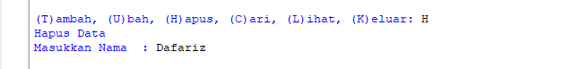

  # Praktikum 6

## Latihan 

# Membuat Dictionary Daftar Kontak

- Dictionary ditulis dengan dipisahkan koma dalam ```{}```

```
telp = {}
telp['Ari'] = '081267888'
telp['Dina'] = '087677776'
```

- menampilkan kontak 

```
print(telepon['Ari'])
```

- menambahkan kontak baru dengan elemen dictionary 

```
telepon['Riko'] = '087654544'
```
- Ubah kontak Dina dengan nomor baru 088999776
```
telp['Dina'] = '088999776'
```

- untuk menampilkan semua nama kontak
```
print(telepon.keys())
```

-hasil yang dikeluarkan


- menampilkan semua nomor telepon/value

```
print(telepon.values())
```

hasil seperti:


- membuat adftr Nama dan Nomor menggunakan perintah ```for```

```
for nama,nomor in telepon.items():
    print("%s \t| %s " % (nama,nomor))
```

Output nya akan menghasilkan


- menghapus kontak Dina menggunakan ```del``` 
seperti:

``` 
del telepon['Dina']
```

Maka kontak Dina akan terhapus


## Tugas Praktikum
1. kita harus membuat dictionary kosong kemudian akan di isi inputan data pada saat program di jalankan 
```
Ha = {}
```
2. kemudian kita akan membuat kondisi perulangan dan membuat sebuah keterangan untuk pilihan menu yang akan menjalankan program tersebut 
```
while True:
    fid = input("\n(T)ambah, (U)bah, (H)apus, (C)ari, (L)ihat, (K)eluar: ")
```
3. membuat syntax untuk menambahkan data 
```
if fid.lower() == 't':
        print("Tambah Data")
        nama = input("Nama           : ")
        nim = int(input("NIM            : "))
        tugas = int(input("Nilai Tugas    : "))
        uts = int(input("Nilai UTS      : "))
        uas = int(input("Nilai UAS      : "))
        akhir = tugas*30/100 + uts*35/100 + uas*35/100
        siswa[nama] = nim, tugas, uts, uas, akhir
```
4. ketika kita akan menginputkan data t maka akan muncul beberapa data,data  yang barusan kita inputan akan masuk ke dictionary,data yang di buat tadi dengan data nama 'keys' dan yang tersisa itu sebagai values


- hasil akan bertambah


5. membuat syntax mengubah data
```
elif fid.lower() == 'u':
        print("Ubah Data")
        nama = input("Masukkan Nama  : ")
        if nama in Ha.keys():
            nim = int(input("NIM            : "))
            tugas = int(input("Nilai Tugas    : "))
            uts = int(input("Nilai UTS      : "))
            uas = int(input("Nilai UAS      : "))
            akhir = tugas * 30 / 100 + uts * 35 / 100 + uas * 35 / 100
            Ha[nama] = nim, tugas, uts, uas, akhir
        else:
            print("Nama {0} tidak ditemukan".format(nama))
```
6. pada saat kita menginputkan data 'u' maka akan muncul mengubah keterangan untuk mengubah data tersebut dan kita akan diminta kembali menginputkan nama yang tadi mau di ubah datanya 'nama {} tidak di temukan' dimana {} untuk mengubah nama atau data yang kita mau


- maka hasil akan berubah


7. membuat syntax menghapus data
```
elif fid.lower() == 'h':
        print("Hapus Data")
        nama = input("Masukkan Nama  : ")
        if nama in Ha.keys():
            del Ha[nama]
        else:
            print("Nama {0} Tidak Ditemukan".format(nama))
```
8. kita akan menginputakn 'h' maka kemudian kita akan diminta untuk menginputakn nama yang akan kita hapus jika nama tersebut ada di dalam system akan menghapus keys/nama yang tadi di inputkan beserta values pada statement del d[nama]



- hasilnya akan terhapus


9.membuat syntax untuk mencari data
```
elif b.lower() == 'c':
        print("Cari Data")
        nama = input("Masukkan Nama : ")
        if nama in a.keys():
            print("="*73)
            print("|                             Daftar Mahasiswa                          |")
            print("="*73)
            print("| Nama            |       NIM       |  UTS  |  UAS  |  Tugas  |  Akhir  |")
            print("="*73)
            print("| {0:15s} | {1:15d} | {2:5d} | {3:5d} | {4:7d} | {5:7.2f} |"
                  .format(nama, nim, uts, uas, tugas, akhir))
            print("="*73)
        else:
            print("Nama {0} Tidak Ditemukan".format(nama))
```
10. ketika kita akan menginputkan 'c' kemudian kita akan diminta untuk menginputkan atau memasukan nama yang akan kita cari tersebut,apabila nama yang di caru ada di dictionary maka akan muncul gambar seperti di bawah ini


- hasil ketika di cari


11. menampilkan data
```
elif fid.lower() == 'l':
        if Ha.items():
            print("="*78)
            print("|                               Daftar Mahasiswa                             |")
            print("="*78)
            print("|No. | Nama            |       NIM       |  UTS  |  UAS  |  Tugas  |  Akhir  |")
            print("="*78)
            i = 0
            for j in a.items():
                i += 1
                print("| {no:2d} | {0:15s} | {1:15d} | {2:5d} | {3:5d} | {4:7d} | {5:7.2f} |"
                      .format(j[0][:13], j[1][0], j[1][1], j[1][2], j[1][3], j[1][4], no=i))
            print("=" * 78)
        else:
            print("="*78)
            print("|                               Daftar Mahasiswa                             |")
            print("="*78)
            print("|No. | Nama            |       NIM       |  UTS  |  UAS  |  Tugas  |  Akhir  |")
            print("="*78)
            print("|                                TIDAK ADA DATA                              |")
            print("="*78)
```
12. kita akan menginputkan 'l' maka secara otomatia sistem yang tadi kita buat akan menampilkan semuanya.jika belum maka akan keluar tampilan 'TIDAK ADA DATA'


13. membuat syntax untuk menghentikan perulangan
```
elif b.lower() == 'k':
        break
```
14.kemudian kita akan menginputkan 'k ' maka secara otomatis program yang kita inputan tadi akan langsung berhenti


15. membuat syntax apabila memilih pilihan yang tidak ada di menu pilihan
```
else:
        print("Pilih menu yang tersedia")
 ```

